# Joint Account with Solidity

This is a joint savings accounts created with a Solidity smart contract accepting two user addresses.  It will use ether management functions to implement a financial institution's requirements for providing features of the joint savings account.  Users will be able to deposit and withdraw funds from the account.

---

## Technologies

Open Remix IDE website (https://remix.ethereum.org/) and run `joint_savings.sol` file.

---

## Remix - Solidity

To interact with the Joint Account smart contract, compile as shown:

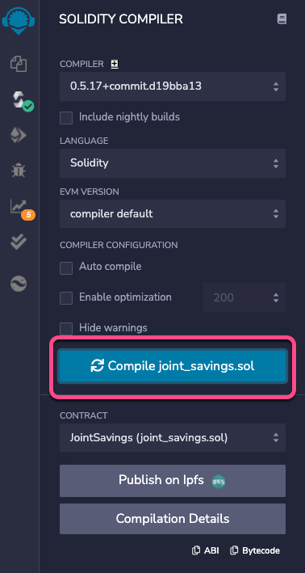

Deploy and run as displayed:

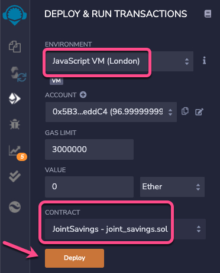

After generating addresses through [Ganache](https://www.trufflesuite.com/ganache), set up account1 and account2:

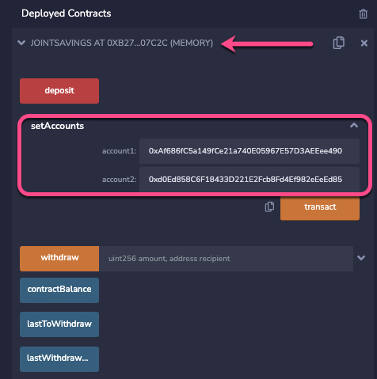

Let's test the **deposit** functionality!

- Transaction 1:  Sending 1 ether as wei.

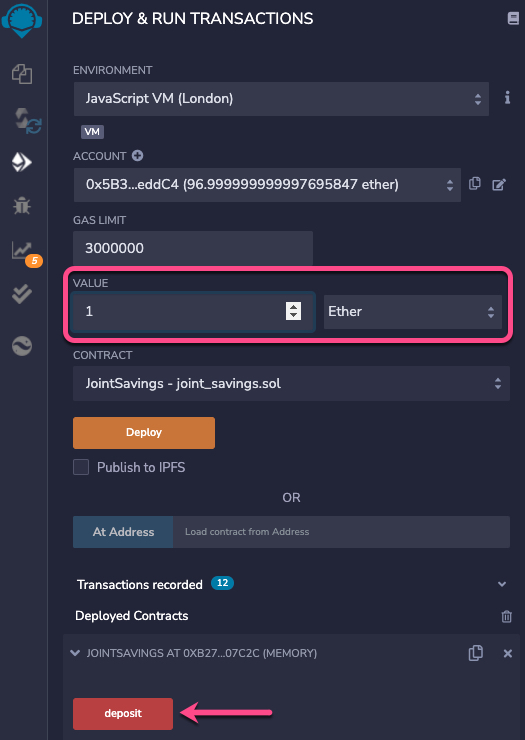\
 \
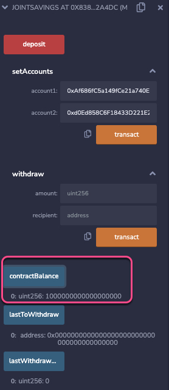\
 \
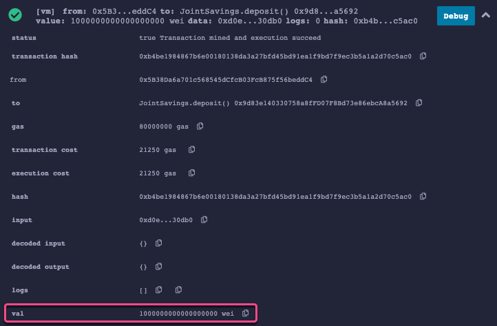

- Transaction 2:  Sending 10 ether as wei.

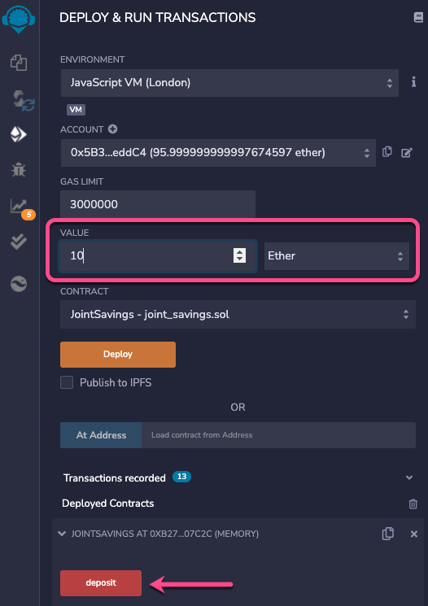\
 \
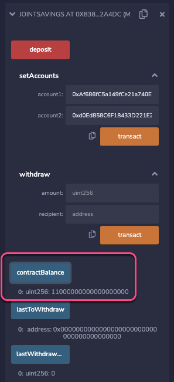\
 \
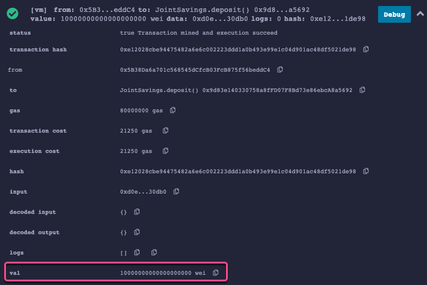

- Transaction 3:  Sending 5 ether.

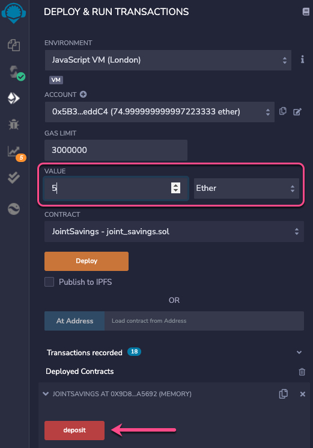\
 \
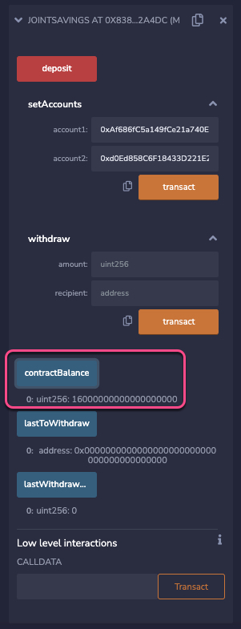\
 \
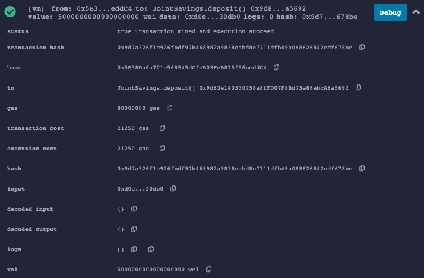

Let's now test the **withdrawal** function!

- Withdraw 5 ether into `accountOne`.

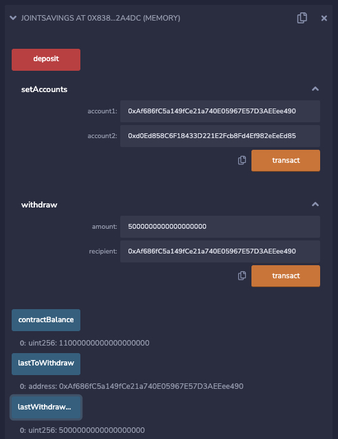

- Withdraw 10 ether into `accountTwo`.

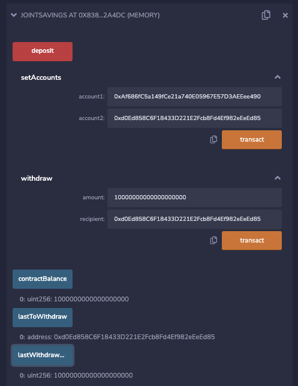

---

## Contributors
Christina San Diego